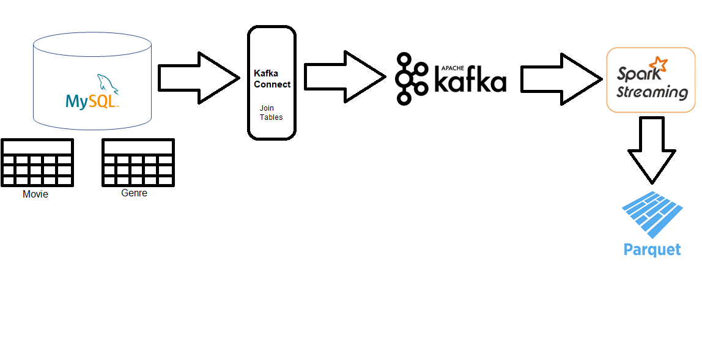

# kafka-connect-spark-structured-streaming-example
Example Application for: MySQL->Kafka Connect->Kafka->Spark Structured Streaming

## Overview
This is an example of an event streaming application where data from a mysql database is ingested via the Kafka Connect JDBC Connector into Apache Kafka. The mysql database consists of a `movie` and a `genre` table. Kafka Connect joins these two tables before ingesting them into Apache Kafka.
Spark Structured Streaming then reads the data from Kafka and writes the data as parquet into local disc into the `output` folder. The Spark Job is running continuously and is logging its logging output into the application-log in the spark-log folder.

## Deployment
All the components are containerized with docker. The whole services are started with a `docker-compose up` command. After the services are all up (it takes a while until kafka connect has started completely) the init script can be executed which deploys the mysql-source-connector and spark
structured streaming job.
